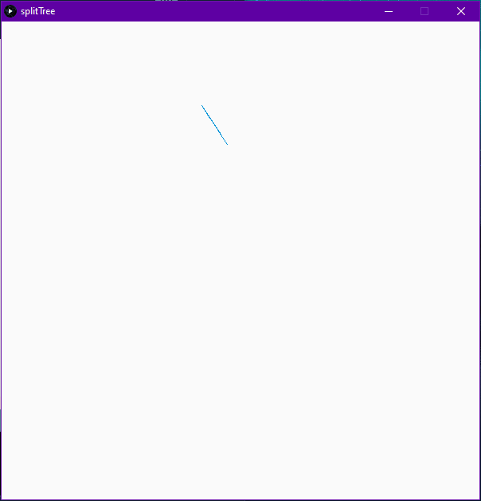

# Split Tree
> Fancy 2D visualization.

## Table of contents
- [Split Tree](#split-tree)
  - [Table of contents](#table-of-contents)
  - [General info](#general-info)
  - [Screenshots](#screenshots)
  - [Technologies](#technologies)
  - [Setup and run](#setup-and-run)
  - [Features](#features)
  - [Issues](#issues)
  - [Status](#status)
  - [Contact](#contact)

## General info
This project is visualization of an idea, that one day popped in my mind. I decided to realize it in Processing, because it allows for very easy and quick visual arts programming.

## Screenshots


(Note that gif runs at only 15 FPS)

## Technologies
* [Processing 3.5.4](https://processing.org/ "Processing webpage")

## Setup and run
[Download Processing 3.5.4](https://processing.org/download/ "Download page"). Download this repository. Run this project via Processing IDE.

To change window size, edit following line in setup function in [SplitTree](./splitTree/SplitTree.pde) file:
```java
void setup() {
  size(<WIDTH_HERE>, <HEIGHT_HERE>);
  background(250);  
  noSmooth();
  tree = new Tree();
}
```

## Features
Animation starts with one line. When the line reaches its destination point, it splits into 2 or 3 (it is random) new lines. Then all lines reach their destinations and they split again, and so on. There is no any UI. Any change must be done on code level.

To-do ideas:
* Add termination condition.
* Draw new lines in random colors.
* Experiment with number of new lines generated after split.

## Issues
After over a dozen iterations, visualization becomes laggy. Besides, almost whole canvas is already in one color, so there is no point in running it any futher (thus termination condition would be handy).

## Status
This project is no longer developed.

## Contact
Created by [@michaltkacz](https://github.com/michaltkacz) - feel free to contact me!